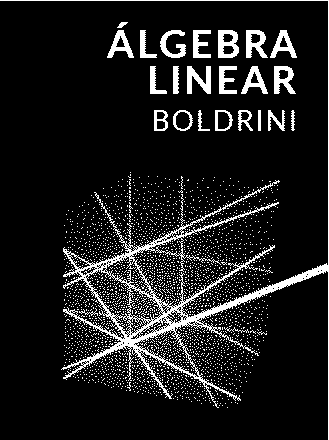
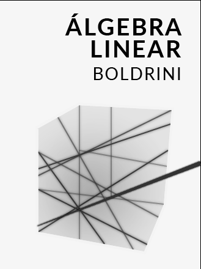

# Comando Convert

__convert__ é um a comnado mundo versátil com várias opções. Quero abordar algumas aqui.

## Problema

Tenho essa imagem abaixo e quero imprimí-la, mas da forma que ela está eu gastaria muita tinta preta.


Porém da forma como está gastaria muita tinta preta e, além disso, a imagem é de baixa resolução (329 X 440) e não 
existe a funcionalidade _scaling_ no serviço de impressão do ubuntu 20.04 que estou atualmente usando.

## Solução

Pensando rapidamente pensei logo em inverter a imagem, mas isso não seria bom pois há tons de verde na imagem e eu
gostaria de economizar na tinta. Então antes de inverter as cores eu preciso converter para preto-e-branco ou 
escala de cinza.

### Convertendo imagem

#### Preto-e-branco

```bash
convert capa_boldrini.png -monochrome capa_boldrini_bw.png
```



#### escala de cinza

```bash
convert capa_boldrini.png -colorspace GRAY capa_boldrini_gray.png
```


### Invertendo imagem

Escolhi em a imagem em escala de cinza pois esta me agradou mais.

```bash
convert capa_boldrini_gray.png -channel RGB -negate capa_boldrini_grey_inverted.png
```



### Ampliando imagem

Agora só me resta ampliar a imagem para que ocupe toda a folha. Escolhi um valor alto pois uma imagem grande não 
é problema pois o sistema de impressão me deixa reduzir uma imagem para caber na folha.

```bash
convert capa_boldrini_grey_inverted.png -resize 220% capa_boldrini_grey_inverted_scaled.png
```

Se quisesse poderia também especificar uma resolução (ex. -resize 720x1080), mas é preciso atentar-se as 
proporções da imagem.

## Resultado


